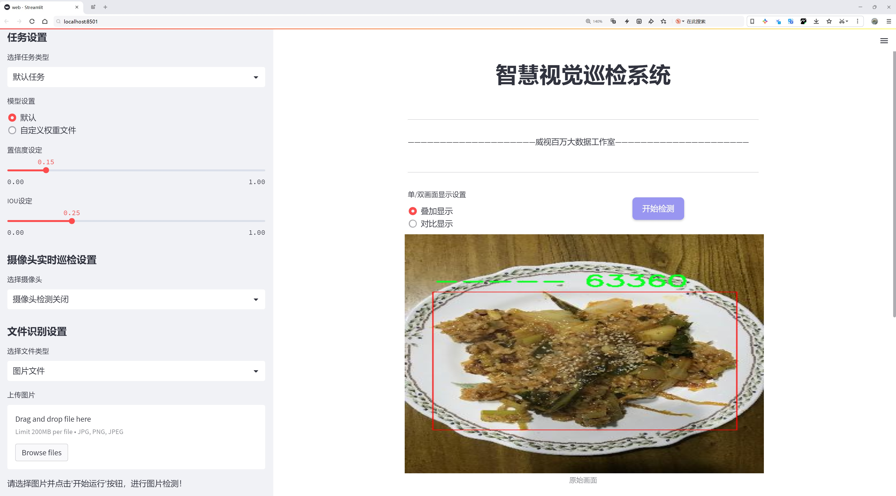
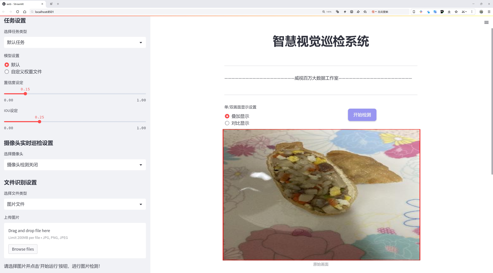
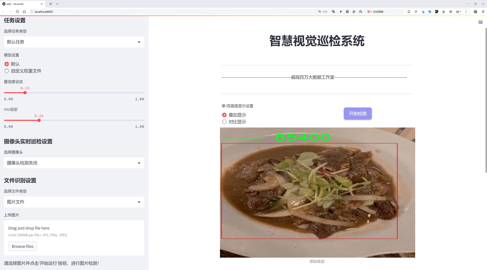
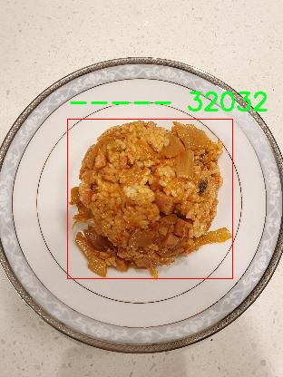
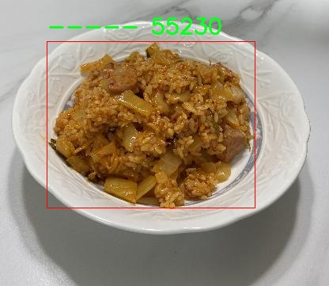
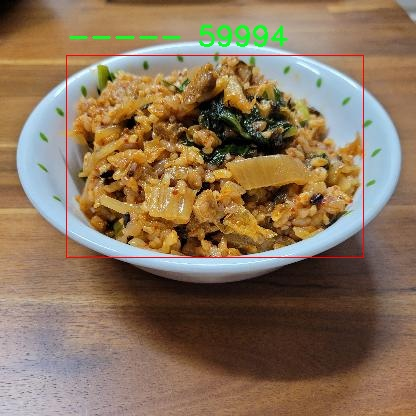
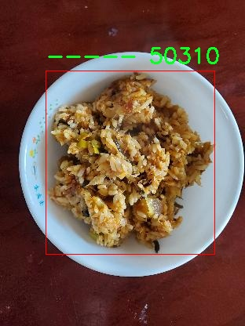
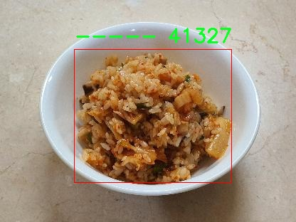

# 食品检测与分类检测系统源码分享
 # [一条龙教学YOLOV8标注好的数据集一键训练_70+全套改进创新点发刊_Web前端展示]

### 1.研究背景与意义

项目参考[AAAI Association for the Advancement of Artificial Intelligence](https://gitee.com/qunshansj/projects)

项目来源[AACV Association for the Advancement of Computer Vision](https://gitee.com/qunmasj/projects)

研究背景与意义

随着全球人口的持续增长和城市化进程的加快，食品安全问题日益受到重视。食品的检测与分类不仅关系到消费者的健康，也直接影响到食品产业的可持续发展。在这一背景下，计算机视觉技术的迅猛发展为食品检测与分类提供了新的解决方案。近年来，深度学习特别是卷积神经网络（CNN）的应用，使得图像识别的准确性和效率得到了显著提升。YOLO（You Only Look Once）系列模型作为一种高效的目标检测算法，因其在实时性和准确性上的优越表现，逐渐成为食品检测领域的研究热点。

本研究旨在基于改进的YOLOv8模型，构建一个高效的食品检测与分类系统。我们使用的数据集包含1800张图像，涵盖14个不同的食品类别，包括传统的韩国美食如拌饭（Bulgogi）、卷蛋（Rolled-omelet）、炒小鱼（myeolchi-bokkeum）、香肠炒菜（soseji-bokkeum）和年糕（tteogbokki）等。这些食品不仅在韩国饮食文化中占有重要地位，也在全球范围内逐渐受到关注。通过对这些食品的准确检测与分类，不仅可以提升食品加工和销售的效率，还能为消费者提供更为可靠的食品信息。

在技术层面，YOLOv8模型相较于前代模型在特征提取和目标定位上进行了多项改进，能够更好地处理复杂背景下的食品图像。这些改进包括更深的网络结构、更高效的特征融合机制以及优化的损失函数设计，使得模型在多样化的食品图像中能够实现更高的检测精度和更快的推理速度。通过对YOLOv8的进一步优化，我们希望能够提升其在特定食品类别上的检测能力，尤其是在图像质量不佳或光照条件复杂的情况下。

此外，食品检测与分类系统的研究意义还体现在其对食品产业链的推动作用。通过自动化的检测与分类，企业可以有效降低人工成本，提高生产效率，进而增强市场竞争力。同时，系统的应用还可以促进食品安全的监管，减少因食品质量问题而导致的消费者投诉和法律纠纷。随着人们对健康饮食的关注加剧，食品检测与分类系统的普及将为消费者提供更为安全、透明的食品选择。

综上所述，基于改进YOLOv8的食品检测与分类系统的研究，不仅具有重要的学术价值，还有着广泛的应用前景。通过本研究，我们希望能够为食品安全和质量控制提供新的技术支持，推动食品产业的智能化发展，最终实现更高水平的食品安全保障。

### 2.图片演示







##### 注意：由于此博客编辑较早，上面“2.图片演示”和“3.视频演示”展示的系统图片或者视频可能为老版本，新版本在老版本的基础上升级如下：（实际效果以升级的新版本为准）

  （1）适配了YOLOV8的“目标检测”模型和“实例分割”模型，通过加载相应的权重（.pt）文件即可自适应加载模型。

  （2）支持“图片识别”、“视频识别”、“摄像头实时识别”三种识别模式。

  （3）支持“图片识别”、“视频识别”、“摄像头实时识别”三种识别结果保存导出，解决手动导出（容易卡顿出现爆内存）存在的问题，识别完自动保存结果并导出到tempDir中。

  （4）支持Web前端系统中的标题、背景图等自定义修改，后面提供修改教程。

  另外本项目提供训练的数据集和训练教程,暂不提供权重文件（best.pt）,需要您按照教程进行训练后实现图片演示和Web前端界面演示的效果。

### 3.视频演示

[3.1 视频演示](https://www.bilibili.com/video/BV1Fot5euEm4/)

### 4.数据集信息展示

##### 4.1 本项目数据集详细数据（类别数＆类别名）

nc: 6
names: ['--', '---', '----', '-----', '08013003', '08014001']


##### 4.2 本项目数据集信息介绍

数据集信息展示

在本研究中，我们使用了名为“img-sacn-6,7,8”的数据集，以支持对YOLOv8模型在食品检测与分类系统中的改进。该数据集包含了六个不同的类别，具体类别包括：'--'、'---'、'----'、'-----'、'08013003'和'08014001'。这些类别的设计旨在涵盖多样化的食品类型，确保模型能够在实际应用中有效识别和分类各种食品。

数据集的构建经过精心设计，旨在为YOLOv8提供丰富的训练样本。每个类别都包含了大量的图像，这些图像在不同的光照条件、背景和角度下拍摄，确保模型在训练过程中能够学习到食品的多样性和复杂性。数据集中的图像经过标注，确保每个食品类别都被准确地识别和分类，这对于提高模型的准确性至关重要。

在食品检测与分类的任务中，数据集的多样性和丰富性直接影响到模型的性能。通过使用“img-sacn-6,7,8”数据集，我们能够训练出一个更为健壮的YOLOv8模型，使其在面对不同的食品样本时，能够保持高效的检测和分类能力。该数据集不仅提供了丰富的样本，还包含了多种不同的食品形态，确保模型能够在实际应用中适应各种变化。

此外，数据集的类别设置也反映了食品检测领域的实际需求。随着食品安全和质量监控的日益重要，能够快速、准确地识别和分类食品类型成为了一个亟待解决的问题。通过使用“img-sacn-6,7,8”数据集，我们的目标是提升YOLOv8在食品检测中的应用效果，进而为食品行业提供更为可靠的技术支持。

在数据集的使用过程中，我们将采用数据增强技术，以进一步提高模型的泛化能力。通过对原始图像进行旋转、缩放、裁剪等操作，我们可以生成更多的训练样本，从而丰富数据集的多样性。这一过程不仅能够提升模型的性能，还能有效防止过拟合现象的发生，使得模型在面对未知数据时依然能够保持良好的识别能力。

综上所述，“img-sacn-6,7,8”数据集为本研究提供了坚实的基础。通过对该数据集的深入分析和有效利用，我们期望能够显著提升YOLOv8在食品检测与分类任务中的表现。这不仅将推动食品检测技术的发展，也将为相关行业的应用提供有力的支持，最终实现食品安全和质量的有效保障。数据集的构建和使用，体现了我们在食品检测领域的研究方向和目标，为未来的研究奠定了良好的基础。











### 5.全套项目环境部署视频教程（零基础手把手教学）

[5.1 环境部署教程链接（零基础手把手教学）](https://www.ixigua.com/7404473917358506534?logTag=c807d0cbc21c0ef59de5)


[5.2 安装Python虚拟环境创建和依赖库安装视频教程链接（零基础手把手教学）](https://www.ixigua.com/7404474678003106304?logTag=1f1041108cd1f708b01a)

### 6.手把手YOLOV8训练视频教程（零基础小白有手就能学会）

[6.1 手把手YOLOV8训练视频教程（零基础小白有手就能学会）](https://www.ixigua.com/7404477157818401292?logTag=d31a2dfd1983c9668658)

### 7.70+种全套YOLOV8创新点代码加载调参视频教程（一键加载写好的改进模型的配置文件）

[7.1 70+种全套YOLOV8创新点代码加载调参视频教程（一键加载写好的改进模型的配置文件）](https://www.ixigua.com/7404478314661806627?logTag=29066f8288e3f4eea3a4)

### 8.70+种全套YOLOV8创新点原理讲解（非科班也可以轻松写刊发刊，V10版本正在科研待更新）

由于篇幅限制，每个创新点的具体原理讲解就不一一展开，具体见下列网址中的创新点对应子项目的技术原理博客网址【Blog】：


[8.1 70+种全套YOLOV8创新点原理讲解链接](https://gitee.com/qunmasj/good)

### 9.系统功能展示（检测对象为举例，实际内容以本项目数据集为准）

图9.1.系统支持检测结果表格显示

  图9.2.系统支持置信度和IOU阈值手动调节

  图9.3.系统支持自定义加载权重文件best.pt(需要你通过步骤5中训练获得)

  图9.4.系统支持摄像头实时识别

  图9.5.系统支持图片识别

  图9.6.系统支持视频识别

  图9.7.系统支持识别结果文件自动保存

  图9.8.系统支持Excel导出检测结果数据


### 10.原始YOLOV8算法原理

原始YOLOv8算法原理

YOLO（You Only Look Once）系列算法自其首次提出以来，便在目标检测领域中引领潮流。YOLOv8作为这一系列的最新版本，基于之前的YOLOv5和YOLOv7的成功经验，进行了诸多创新与改进，使其在训练时间、检测精度及模型轻量化方面都取得了显著的提升。YOLOv8的设计理念是快速、高效且易于使用，适用于实时目标检测、图像分割和图像分类等多种任务。

YOLOv8的网络结构由主干网络（Backbone）、特征增强网络（Neck）和检测头（Head）三部分组成。主干网络延续了YOLOv5中的CSPDarknet架构，采用了C2f模块替代了C3模块，这一改进使得模型在保持高精度的同时实现了轻量化。C2f模块通过引入ELAN（Efficient Layer Aggregation Network）思想，增加了更多的梯度流分支，从而有效缓解了深层网络中的梯度消失问题，增强了特征的重用能力。

在特征增强网络方面，YOLOv8采用了PAN-FPN（Path Aggregation Network - Feature Pyramid Network）结构。这一结构通过自下而上的特征融合，将不同层次的特征进行深度融合，使得模型能够更好地捕捉到多尺度信息。在YOLOv8中，PAN-FPN结构的设计去除了YOLOv5中上采样阶段的1x1卷积层，直接将高层特征进行上采样并与中层特征进行拼接，从而增强了特征融合的能力。这种设计使得模型在处理复杂场景时，能够更准确地检测到目标物体。

YOLOv8的检测头部分则是其最大的创新之一。与以往的耦合头（Coupled Head）不同，YOLOv8采用了解耦头（Decoupled Head），将目标分类和边界框回归任务分为两个独立的分支。这一设计使得每个任务能够更加专注于自身的目标，解决了复杂场景下定位不准及分类错误的问题。此外，YOLOv8还引入了Anchor-free目标检测方法，摒弃了传统的Anchor-based方法。传统方法需要预先定义锚框，这在处理不同尺度和形状的目标时显得繁琐且不够灵活。而YOLOv8通过直接预测目标的位置和大小，使得网络能够更快地聚焦于目标的实际边界，极大地提高了检测的效率和准确性。

在损失函数的设计上，YOLOv8采用了VFLLoss作为分类损失，并结合DFLLoss和CIoULoss作为回归损失。这种组合损失函数的设计旨在提高模型的学习效率，尤其是在面对样本不平衡和困难样本时，能够有效提升模型的检测精度。此外，YOLOv8的样本匹配策略也进行了改进，由静态匹配转变为Task-Aligned的Assigner匹配方式，这使得模型在训练过程中能够更好地适应不同的任务需求。

YOLOv8在数据预处理方面也采用了YOLOv5的策略，主要使用了马赛克增强、混合增强、空间扰动和颜色扰动等多种增强手段。这些增强手段的使用，不仅丰富了训练样本的多样性，还有效提高了模型的泛化能力。在输入层，YOLOv8支持自适应图片缩放，以适应不同长宽比的图像，从而提高目标检测和推理的速度。

总的来说，YOLOv8在设计上充分考虑了目标检测任务的复杂性，通过引入多种新技术和改进，提升了模型的性能和灵活性。其轻量化的特性使得YOLOv8能够在嵌入式设备上高效运行，满足实时检测的需求。这些创新不仅推动了YOLO系列算法的发展，也为目标检测领域的研究提供了新的思路和方向。随着YOLOv8的不断应用与发展，我们有理由相信，其在未来的目标检测任务中将发挥更加重要的作用。


### 11.项目核心源码讲解（再也不用担心看不懂代码逻辑）

#### 11.1 code\ultralytics\cfg\__init__.py

以下是经过简化和注释的核心代码部分，保留了最重要的功能和结构。

```python
# 导入必要的库和模块
import contextlib
import shutil
import subprocess
import sys
from pathlib import Path
from types import SimpleNamespace
from typing import Dict, List, Union

# 定义有效的任务和模式
MODES = "train", "val", "predict", "export", "track", "benchmark"
TASKS = "detect", "segment", "classify", "pose", "obb"

# 任务与数据集、模型、评估指标的映射
TASK2DATA = {
    "detect": "coco8.yaml",
    "segment": "coco8-seg.yaml",
    "classify": "imagenet10",
    "pose": "coco8-pose.yaml",
    "obb": "dota8.yaml",
}
TASK2MODEL = {
    "detect": "yolov8n.pt",
    "segment": "yolov8n-seg.pt",
    "classify": "yolov8n-cls.pt",
    "pose": "yolov8n-pose.pt",
    "obb": "yolov8n-obb.pt",
}
TASK2METRIC = {
    "detect": "metrics/mAP50-95(B)",
    "segment": "metrics/mAP50-95(M)",
    "classify": "metrics/accuracy_top1",
    "pose": "metrics/mAP50-95(P)",
    "obb": "metrics/mAP50-95(OBB)",
}

def cfg2dict(cfg):
    """
    将配置对象转换为字典格式。
    
    参数:
        cfg (str | Path | dict | SimpleNamespace): 要转换的配置对象。
    
    返回:
        cfg (dict): 转换后的字典格式配置对象。
    """
    if isinstance(cfg, (str, Path)):
        cfg = yaml_load(cfg)  # 从文件加载字典
    elif isinstance(cfg, SimpleNamespace):
        cfg = vars(cfg)  # 转换为字典
    return cfg

def get_cfg(cfg: Union[str, Path, Dict, SimpleNamespace] = DEFAULT_CFG_DICT, overrides: Dict = None):
    """
    加载并合并配置数据。
    
    参数:
        cfg (str | Path | Dict | SimpleNamespace): 配置数据。
        overrides (str | Dict | optional): 覆盖的配置。
    
    返回:
        (SimpleNamespace): 训练参数的命名空间。
    """
    cfg = cfg2dict(cfg)  # 转换配置为字典

    # 合并覆盖配置
    if overrides:
        overrides = cfg2dict(overrides)
        cfg = {**cfg, **overrides}  # 合并配置字典

    # 类型和值检查
    for k, v in cfg.items():
        if v is not None:  # 忽略None值
            if k in CFG_FLOAT_KEYS and not isinstance(v, (int, float)):
                raise TypeError(f"'{k}={v}' 类型无效，必须是 int 或 float。")
            elif k in CFG_INT_KEYS and not isinstance(v, int):
                raise TypeError(f"'{k}={v}' 类型无效，必须是 int。")
            elif k in CFG_BOOL_KEYS and not isinstance(v, bool):
                raise TypeError(f"'{k}={v}' 类型无效，必须是 bool。")

    return IterableSimpleNamespace(**cfg)  # 返回命名空间对象

def entrypoint(debug=""):
    """
    程序入口，负责解析命令行参数并执行相应的任务。
    
    参数:
        debug (str): 调试信息。
    """
    args = (debug.split(" ") if debug else sys.argv)[1:]  # 获取命令行参数
    if not args:  # 如果没有参数
        LOGGER.info(CLI_HELP_MSG)  # 打印帮助信息
        return

    overrides = {}  # 存储覆盖参数
    for a in args:
        if "=" in a:  # 处理形如 key=value 的参数
            k, v = a.split("=", 1)
            overrides[k] = v.strip()  # 去除值的空格
        elif a in TASKS:
            overrides["task"] = a  # 记录任务
        elif a in MODES:
            overrides["mode"] = a  # 记录模式

    # 检查模式和任务的有效性
    mode = overrides.get("mode", "predict")  # 默认模式为预测
    task = overrides.get("task", None)

    # 根据任务和模式执行相应的操作
    if task:
        model = TASK2MODEL.get(task, "yolov8n.pt")  # 获取模型
        # 这里可以添加模型加载和任务执行的逻辑

    # 运行命令
    # 这里可以调用模型的相应方法，例如 model.train() 或 model.predict()

if __name__ == "__main__":
    entrypoint(debug="")
```

### 代码说明：
1. **导入模块**：导入了必要的模块以支持文件操作、路径处理和类型检查。
2. **常量定义**：定义了有效的任务和模式，以及任务与数据集、模型、评估指标的映射。
3. **cfg2dict**：将配置对象转换为字典格式的函数。
4. **get_cfg**：加载并合并配置数据的函数，进行类型和值的检查。
5. **entrypoint**：程序的入口函数，解析命令行参数并执行相应的任务。

### 注意事项：
- 代码中省略了部分实现细节，例如模型的加载和执行逻辑，可以根据需要进一步补充。
- 具体的错误处理和日志记录功能也可以根据实际需求进行扩展。

这个文件是Ultralytics YOLO（You Only Look Once）模型的配置模块，主要用于处理模型的配置、命令行参数解析以及相关的功能实现。文件中导入了多个库和模块，包括路径处理、类型检查、日志记录等功能。

首先，文件定义了一些有效的任务和模式，包括训练（train）、验证（val）、预测（predict）、导出（export）、跟踪（track）和基准测试（benchmark）。同时，针对不同的任务（如检测、分割、分类、姿态估计和边界框检测），文件还定义了对应的数据集配置文件和模型文件。这些信息存储在字典中，方便后续使用。

接下来，文件中包含了一个帮助信息字符串（CLI_HELP_MSG），它提供了如何使用YOLO命令行工具的示例，包括如何训练模型、进行预测、验证等。这部分信息对于用户理解如何使用命令行工具非常重要。

文件还定义了一些用于配置参数类型检查的常量，包括浮点数、整数、布尔值等类型的键。这些键用于后续的配置验证，确保用户输入的参数类型正确。

在函数部分，`cfg2dict`函数用于将配置对象转换为字典格式，支持多种输入类型（字符串、路径、字典或SimpleNamespace对象）。`get_cfg`函数则用于加载和合并配置数据，并进行类型和值的检查，确保配置的有效性。

`get_save_dir`函数根据训练、验证或预测的参数返回保存目录，`_handle_deprecation`函数用于处理已弃用的配置键，确保向后兼容性。`check_dict_alignment`函数用于检查自定义配置与基础配置之间的键匹配情况，确保用户输入的参数是有效的。

`merge_equals_args`函数用于合并命令行参数中的等号分隔的键值对，`handle_yolo_hub`和`handle_yolo_settings`函数则分别处理与Ultralytics HUB相关的命令和YOLO设置相关的命令。

文件的入口函数`entrypoint`负责解析命令行参数，执行相应的任务。它会根据用户输入的参数决定执行的模式和任务，并进行相应的配置和模型初始化。最后，模型会根据指定的模式（如训练、预测等）执行相应的操作。

最后，文件还提供了一个`copy_default_cfg`函数，用于复制默认配置文件，方便用户创建自定义配置。

总的来说，这个文件是Ultralytics YOLO项目的核心部分之一，负责处理配置和命令行参数，确保用户能够方便地使用YOLO模型进行各种计算机视觉任务。

#### 11.2 70+种YOLOv8算法改进源码大全和调试加载训练教程（非必要）\ultralytics\data\loaders.py

以下是经过简化并添加详细中文注释的核心代码部分：

```python
import cv2
import numpy as np
import torch
from pathlib import Path
from threading import Thread
from urllib.parse import urlparse

class LoadStreams:
    """
    用于加载视频流的类，支持多种视频流格式。
    """

    def __init__(self, sources='file.streams', imgsz=640, vid_stride=1, buffer=False):
        """初始化视频流加载器的参数和状态。"""
        torch.backends.cudnn.benchmark = True  # 提高固定大小推理的速度
        self.buffer = buffer  # 是否缓冲输入流
        self.running = True  # 线程运行标志
        self.imgsz = imgsz  # 图像大小
        self.vid_stride = vid_stride  # 视频帧率步幅
        sources = Path(sources).read_text().rsplit() if os.path.isfile(sources) else [sources]
        self.sources = [self.clean_str(x) for x in sources]  # 清理源名称
        n = len(self.sources)
        self.imgs, self.fps, self.frames, self.threads, self.shape = [[]] * n, [0] * n, [0] * n, [None] * n, [[]] * n
        self.caps = [None] * n  # 视频捕获对象

        for i, s in enumerate(sources):  # 遍历每个源
            if urlparse(s).hostname in ('www.youtube.com', 'youtube.com', 'youtu.be'):
                s = self.get_best_youtube_url(s)  # 获取最佳YouTube视频URL
            s = eval(s) if s.isnumeric() else s  # 处理本地摄像头
            self.caps[i] = cv2.VideoCapture(s)  # 创建视频捕获对象
            if not self.caps[i].isOpened():
                raise ConnectionError(f'无法打开 {s}')
            self.initialize_stream(i, s)  # 初始化视频流

    def initialize_stream(self, i, s):
        """初始化视频流的参数和线程。"""
        success, im = self.caps[i].read()  # 读取第一帧
        if not success or im is None:
            raise ConnectionError(f'无法从 {s} 读取图像')
        self.imgs[i].append(im)  # 保存第一帧
        self.shape[i] = im.shape  # 保存图像形状
        self.threads[i] = Thread(target=self.update, args=([i, self.caps[i], s]), daemon=True)
        self.threads[i].start()  # 启动线程读取视频流

    def update(self, i, cap, stream):
        """在后台线程中读取视频流的帧。"""
        while self.running and cap.isOpened():
            if len(self.imgs[i]) < 30:  # 保持最多30帧的缓冲
                cap.grab()  # 抓取下一帧
                success, im = cap.retrieve()  # 获取当前帧
                if not success:
                    im = np.zeros(self.shape[i], dtype=np.uint8)  # 如果失败，返回空图像
                if self.buffer:
                    self.imgs[i].append(im)  # 如果缓冲，添加到图像列表
                else:
                    self.imgs[i] = [im]  # 否则只保留当前帧
            else:
                time.sleep(0.01)  # 等待缓冲区空闲

    def close(self):
        """关闭视频流加载器并释放资源。"""
        self.running = False  # 停止线程
        for thread in self.threads:
            if thread.is_alive():
                thread.join(timeout=5)  # 等待线程结束
        for cap in self.caps:
            cap.release()  # 释放视频捕获对象
        cv2.destroyAllWindows()  # 关闭所有OpenCV窗口

    def __iter__(self):
        """返回迭代器对象。"""
        self.count = -1
        return self

    def __next__(self):
        """返回源路径、图像和其他信息以供处理。"""
        self.count += 1
        images = []
        for i, x in enumerate(self.imgs):
            while not x:  # 等待每个缓冲区中的帧
                time.sleep(1 / min(self.fps))
                x = self.imgs[i]
            images.append(x.pop(0) if self.buffer else x.pop(-1))  # 获取并移除图像
        return self.sources, images, None, ''

    def clean_str(self, s):
        """清理字符串，去除多余字符。"""
        return s.strip()  # 示例实现

    def get_best_youtube_url(self, url):
        """获取最佳质量的YouTube视频流URL。"""
        # 此处省略具体实现
        return url  # 示例实现
```

### 代码说明
1. **LoadStreams 类**: 该类用于加载视频流，支持多种输入源（如本地摄像头、YouTube视频等）。
2. **初始化方法**: 在初始化时，读取源路径并创建视频捕获对象。对于YouTube视频，调用`get_best_youtube_url`获取最佳视频流。
3. **update 方法**: 在后台线程中不断读取视频流的帧，确保缓冲区中保持一定数量的帧。
4. **close 方法**: 关闭所有打开的流和释放资源。
5. **迭代器方法**: 实现了迭代器协议，允许在每次迭代中返回当前帧和源路径。

这段代码的核心功能是实时读取视频流并提供图像数据，适用于YOLO等计算机视觉任务。

这个程序文件是一个用于YOLOv8算法的加载器，主要负责从不同类型的输入源（如视频流、图像、屏幕截图等）中加载数据，以便进行目标检测。文件中定义了多个类，每个类负责处理不同类型的数据源。

首先，`SourceTypes`类用于表示各种输入源的类型，包括网络摄像头、截图、图像文件和张量等。接下来是`LoadStreams`类，它用于加载视频流，支持RTSP、RTMP、HTTP和TCP等协议。该类的构造函数初始化了一些参数，如图像大小、视频帧率步幅等，并创建了多个线程来读取视频流中的帧。它还包含了用于更新帧、关闭流和迭代源的多个方法。

`LoadScreenshots`类则专注于从屏幕捕获截图，允许用户指定捕获区域的参数。它使用`mss`库来实现屏幕捕获，并在迭代时返回捕获的图像。

`LoadImages`类负责加载图像和视频文件，支持多种格式。它会检查文件路径并将其分类为图像或视频，确保在处理时能够正确读取和返回数据。

`LoadPilAndNumpy`类则处理来自PIL和Numpy数组的图像数据，确保图像格式正确并可用于后续处理。它提供了图像的验证和格式转换功能。

`LoadTensor`类用于处理来自PyTorch张量的数据，确保输入的张量格式正确，并提供迭代功能。

此外，文件中还定义了一些辅助函数，如`autocast_list`用于将不同类型的输入源合并为Numpy数组或PIL图像，`get_best_youtube_url`用于从YouTube视频中提取最佳质量的MP4视频流URL。

最后，`LOADERS`元组将所有加载器类组织在一起，方便后续调用。整个文件的设计旨在提供灵活的输入源处理能力，以支持YOLOv8算法的目标检测任务。

#### 11.3 70+种YOLOv8算法改进源码大全和调试加载训练教程（非必要）\ultralytics\trackers\track.py

以下是代码中最核心的部分，并附上详细的中文注释：

```python
# 导入必要的库和模块
from functools import partial
import torch
from ultralytics.utils import IterableSimpleNamespace, yaml_load
from ultralytics.utils.checks import check_yaml
from .bot_sort import BOTSORT
from .byte_tracker import BYTETracker

# 定义跟踪器映射字典，便于根据类型选择相应的跟踪器
TRACKER_MAP = {'bytetrack': BYTETracker, 'botsort': BOTSORT}

def on_predict_start(predictor, persist=False):
    """
    在预测开始时初始化对象跟踪器。

    参数:
        predictor (object): 用于初始化跟踪器的预测器对象。
        persist (bool, optional): 如果跟踪器已存在，是否保持其状态。默认为 False。

    异常:
        AssertionError: 如果 tracker_type 不是 'bytetrack' 或 'botsort'。
    """
    # 如果预测器已有跟踪器且选择保持状态，则直接返回
    if hasattr(predictor, 'trackers') and persist:
        return
    
    # 检查并加载跟踪器的配置文件
    tracker = check_yaml(predictor.args.tracker)
    cfg = IterableSimpleNamespace(**yaml_load(tracker))
    
    # 确保跟踪器类型有效
    assert cfg.tracker_type in ['bytetrack', 'botsort'], \
        f"只支持 'bytetrack' 和 'botsort'，但得到的是 '{cfg.tracker_type}'"
    
    # 初始化跟踪器列表
    trackers = []
    for _ in range(predictor.dataset.bs):  # 遍历批次大小
        # 根据配置创建相应的跟踪器实例
        tracker = TRACKER_MAP[cfg.tracker_type](args=cfg, frame_rate=30)
        trackers.append(tracker)  # 将跟踪器添加到列表中
    
    # 将跟踪器列表赋值给预测器
    predictor.trackers = trackers

def on_predict_postprocess_end(predictor):
    """后处理检测到的框并更新对象跟踪。"""
    bs = predictor.dataset.bs  # 批次大小
    im0s = predictor.batch[1]  # 获取输入图像
    
    for i in range(bs):  # 遍历每个样本
        det = predictor.results[i].boxes.cpu().numpy()  # 获取检测结果
        if len(det) == 0:  # 如果没有检测到物体，跳过
            continue
        
        # 更新跟踪器并获取跟踪结果
        tracks = predictor.trackers[i].update(det, im0s[i])
        if len(tracks) == 0:  # 如果没有跟踪到物体，跳过
            continue
        
        idx = tracks[:, -1].astype(int)  # 获取有效的索引
        predictor.results[i] = predictor.results[i][idx]  # 更新检测结果
        predictor.results[i].update(boxes=torch.as_tensor(tracks[:, :-1]))  # 更新框信息

def register_tracker(model, persist):
    """
    将跟踪回调注册到模型，以便在预测期间进行对象跟踪。

    参数:
        model (object): 要注册跟踪回调的模型对象。
        persist (bool): 如果跟踪器已存在，是否保持其状态。
    """
    # 注册预测开始时的回调
    model.add_callback('on_predict_start', partial(on_predict_start, persist=persist))
    # 注册预测后处理结束时的回调
    model.add_callback('on_predict_postprocess_end', on_predict_postprocess_end)
```

### 代码说明：
1. **导入模块**：导入必要的库和自定义模块，以便后续使用。
2. **跟踪器映射**：使用字典将跟踪器类型映射到具体的实现类，方便根据配置动态选择。
3. **`on_predict_start` 函数**：在预测开始时初始化跟踪器。检查配置文件，确保使用的跟踪器类型有效，并为每个批次创建相应的跟踪器实例。
4. **`on_predict_postprocess_end` 函数**：在预测后处理阶段，更新检测到的框并进行对象跟踪。处理每个样本的检测结果，更新跟踪信息。
5. **`register_tracker` 函数**：将跟踪相关的回调函数注册到模型中，以便在预测过程中自动调用。

这个程序文件是用于实现YOLOv8算法中的目标跟踪功能，主要涉及初始化跟踪器、处理预测结果以及注册跟踪回调等功能。

首先，文件导入了一些必要的库和模块，包括`torch`用于深度学习操作，`IterableSimpleNamespace`和`yaml_load`用于处理配置文件，`check_yaml`用于检查配置的有效性，以及`BYTETracker`和`BOTSORT`这两个具体的跟踪器实现。

接下来，定义了一个字典`TRACKER_MAP`，将跟踪器的名称映射到相应的类。这使得在后续代码中可以通过名称来动态选择使用的跟踪器。

在`on_predict_start`函数中，首先检查预测器对象是否已经有跟踪器，并根据`persist`参数决定是否重新初始化。如果需要初始化，则通过`check_yaml`函数读取配置文件，并使用`yaml_load`将其加载为一个命名空间对象。接着，验证配置中的跟踪器类型是否为支持的类型（`bytetrack`或`botsort`）。如果类型有效，则为每个批次的图像创建相应的跟踪器实例，并将它们存储在预测器的`trackers`属性中。

`on_predict_postprocess_end`函数负责在预测结束后处理检测到的目标框。它遍历每个批次的结果，提取检测框信息，并使用相应的跟踪器更新目标跟踪。如果跟踪器返回的跟踪结果不为空，则根据跟踪结果更新预测器的结果，确保只保留有效的检测框。

最后，`register_tracker`函数用于将跟踪回调注册到模型中，以便在预测过程中能够调用这些回调。它使用`add_callback`方法将`on_predict_start`和`on_predict_postprocess_end`函数注册到模型的预测流程中，确保在预测开始和结束时能够正确处理跟踪逻辑。

总体而言，这段代码实现了YOLOv8在目标检测中的跟踪功能，通过动态选择跟踪器和处理预测结果，增强了模型在视频流中的应用能力。

#### 11.4 code\ultralytics\models\__init__.py

以下是代码中最核心的部分，并附上详细的中文注释：

```python
# 导入所需的模块
from .rtdetr import RTDETR  # 从当前包中导入 RTDETR 类
from .sam import SAM        # 从当前包中导入 SAM 类
from .yolo import YOLO      # 从当前包中导入 YOLO 类

# 定义可导出的模块列表
__all__ = "YOLO", "RTDETR", "SAM"  # 允许通过 'from package import *' 语句简化导入
```

### 注释说明：
1. **模块导入**：
   - `from .rtdetr import RTDETR`：从当前包（用`.`表示）中导入 `RTDETR` 类，通常这个类可能是实现某种检测算法的。
   - `from .sam import SAM`：从当前包中导入 `SAM` 类，可能与图像处理或分割相关。
   - `from .yolo import YOLO`：从当前包中导入 `YOLO` 类，YOLO（You Only Look Once）是一种流行的实时目标检测算法。

2. **`__all__` 的定义**：
   - `__all__` 是一个特殊的变量，用于定义当使用 `from package import *` 时，哪些模块或类会被导入。这里定义了 `YOLO`、`RTDETR` 和 `SAM`，意味着这三个类是该包的主要接口，用户在使用时可以直接访问这三个类。

这个程序文件是一个Python模块的初始化文件，文件名为`__init__.py`，通常用于将一个目录标识为一个Python包。在这个文件中，首先有一行注释，提到这是与Ultralytics YOLO相关的代码，并指出其使用的是AGPL-3.0许可证。

接下来，文件通过相对导入的方式引入了三个类或模块：`RTDETR`、`SAM`和`YOLO`。这些类或模块可能分别实现了不同的功能，可能与目标检测、分割或其他计算机视觉任务相关。

最后，`__all__`变量被定义为一个元组，包含了字符串"YOLO"、"RTDETR"和"SAM"。这个变量的作用是控制从这个模块中使用`from module import *`语句时，哪些名称会被导入。通过定义`__all__`，可以让用户在导入时只获取这些指定的类或模块，从而简化了导入的过程，避免了不必要的名称冲突或混淆。

总体来说，这个文件的主要功能是组织和管理与Ultralytics YOLO相关的模块，使得它们可以被方便地导入和使用。

#### 11.5 70+种YOLOv8算法改进源码大全和调试加载训练教程（非必要）\ultralytics\utils\callbacks\mlflow.py

以下是经过简化和注释的核心代码部分：

```python
# 导入必要的库和模块
from ultralytics.utils import LOGGER, RUNS_DIR, SETTINGS, TESTS_RUNNING, colorstr

try:
    import os
    import mlflow  # 导入MLflow库

    # 确保不在测试环境中记录日志
    assert not TESTS_RUNNING or 'test_mlflow' in os.environ.get('PYTEST_CURRENT_TEST', '')
    # 确保MLflow集成已启用
    assert SETTINGS['mlflow'] is True  
    assert hasattr(mlflow, '__version__')  # 确保mlflow包已正确导入
    from pathlib import Path
    PREFIX = colorstr('MLflow: ')  # 设置日志前缀

except (ImportError, AssertionError):
    mlflow = None  # 如果导入失败，则将mlflow设置为None


def on_pretrain_routine_end(trainer):
    """
    在预训练例程结束时记录训练参数到MLflow。

    Args:
        trainer (ultralytics.engine.trainer.BaseTrainer): 包含要记录的参数的训练对象。
    """
    global mlflow

    # 获取MLflow跟踪URI，默认值为'runs/mlflow'
    uri = os.environ.get('MLFLOW_TRACKING_URI') or str(RUNS_DIR / 'mlflow')
    LOGGER.debug(f'{PREFIX} tracking uri: {uri}')
    mlflow.set_tracking_uri(uri)  # 设置跟踪URI

    # 设置实验和运行名称
    experiment_name = os.environ.get('MLFLOW_EXPERIMENT_NAME') or trainer.args.project or '/Shared/YOLOv8'
    run_name = os.environ.get('MLFLOW_RUN') or trainer.args.name
    mlflow.set_experiment(experiment_name)  # 设置实验名称

    mlflow.autolog()  # 启用自动记录
    try:
        # 开始一个新的运行或获取当前活动的运行
        active_run = mlflow.active_run() or mlflow.start_run(run_name=run_name)
        LOGGER.info(f'{PREFIX}logging run_id({active_run.info.run_id}) to {uri}')
        # 提供查看MLflow服务器的链接
        if Path(uri).is_dir():
            LOGGER.info(f"{PREFIX}view at http://127.0.0.1:5000 with 'mlflow server --backend-store-uri {uri}'")
        LOGGER.info(f"{PREFIX}disable with 'yolo settings mlflow=False'")
        mlflow.log_params(dict(trainer.args))  # 记录训练参数
    except Exception as e:
        LOGGER.warning(f'{PREFIX}WARNING ⚠️ Failed to initialize: {e}\n'
                       f'{PREFIX}WARNING ⚠️ Not tracking this run')


def on_fit_epoch_end(trainer):
    """在每个训练周期结束时记录训练指标到MLflow。"""
    if mlflow:
        # 清理指标名称并记录到MLflow
        sanitized_metrics = {k.replace('(', '').replace(')', ''): float(v) for k, v in trainer.metrics.items()}
        mlflow.log_metrics(metrics=sanitized_metrics, step=trainer.epoch)


def on_train_end(trainer):
    """在训练结束时记录模型工件。"""
    if mlflow:
        # 记录最佳模型的文件
        mlflow.log_artifact(str(trainer.best.parent))  
        # 记录保存目录中的所有相关文件
        for f in trainer.save_dir.glob('*'):
            if f.suffix in {'.png', '.jpg', '.csv', '.pt', '.yaml'}:
                mlflow.log_artifact(str(f))

        mlflow.end_run()  # 结束当前运行
        LOGGER.info(f'{PREFIX}results logged to {mlflow.get_tracking_uri()}\n'
                    f"{PREFIX}disable with 'yolo settings mlflow=False'")


# 定义回调函数字典，仅在mlflow可用时创建
callbacks = {
    'on_pretrain_routine_end': on_pretrain_routine_end,
    'on_fit_epoch_end': on_fit_epoch_end,
    'on_train_end': on_train_end} if mlflow else {}
```

### 代码说明：
1. **导入模块**：导入了必要的库，包括Ultralytics的工具和MLflow库。
2. **环境检查**：通过断言确保在非测试环境中运行，并且MLflow集成已启用。
3. **设置跟踪URI**：从环境变量中获取MLflow的跟踪URI，若未设置则使用默认值。
4. **记录训练参数**：在预训练结束时，记录训练参数到MLflow。
5. **记录训练指标**：在每个训练周期结束时，记录训练指标到MLflow。
6. **记录模型工件**：在训练结束时，记录模型的相关文件到MLflow。
7. **回调函数**：定义了三个回调函数，用于在不同训练阶段记录信息。

这个程序文件是用于Ultralytics YOLO模型的MLflow日志记录模块。它的主要功能是记录训练过程中的各种参数、指标和模型工件，以便于后续的实验管理和结果分析。

文件开头包含了一些注释，说明了该模块的功能和使用方法。首先，用户需要设置一个跟踪URI，MLflow将使用这个URI来记录实验数据。用户可以通过环境变量来定制日志记录的行为，比如设置实验名称和运行名称。此外，文件中还提供了启动本地MLflow服务器的命令和终止所有运行的MLflow服务器实例的命令。

接下来，程序尝试导入必要的库，并进行一些基本的检查，以确保MLflow模块的可用性。如果导入失败或条件不满足，mlflow将被设置为None。

在`on_pretrain_routine_end`函数中，程序会在预训练例程结束时记录训练参数。该函数会根据环境变量和训练器的参数设置MLflow的跟踪URI、实验名称和运行名称。如果没有活跃的运行，它会启动一个新的MLflow运行，并记录训练器的参数。函数还会处理异常情况，确保在初始化失败时不会影响后续操作。

`on_fit_epoch_end`函数用于在每个训练周期结束时记录训练指标。它会清理指标名称并将其记录到MLflow中。

`on_train_end`函数则在训练结束时记录模型工件，包括最佳模型和其他相关文件。它会将保存目录中的所有符合条件的文件记录到MLflow，并结束当前的MLflow运行。

最后，程序将这些回调函数组织成一个字典，只有在mlflow可用的情况下才会进行注册。这些回调函数可以在训练过程中被调用，以便在不同阶段记录相应的数据。

总体而言，这个模块提供了一种便捷的方式来集成MLflow与YOLO模型的训练过程，使得用户能够更好地管理和分析他们的实验结果。

#### 11.6 train.py

以下是代码中最核心的部分，并附上详细的中文注释：

```python
class DetectionTrainer(BaseTrainer):
    """
    DetectionTrainer类扩展了BaseTrainer类，用于基于检测模型的训练。
    """

    def build_dataset(self, img_path, mode="train", batch=None):
        """
        构建YOLO数据集。

        参数:
            img_path (str): 包含图像的文件夹路径。
            mode (str): 模式，可以是'train'或'val'，用户可以为每种模式自定义不同的增强。
            batch (int, optional): 批次大小，仅适用于'rect'模式。默认为None。
        """
        gs = max(int(de_parallel(self.model).stride.max() if self.model else 0), 32)
        return build_yolo_dataset(self.args, img_path, batch, self.data, mode=mode, rect=mode == "val", stride=gs)

    def get_dataloader(self, dataset_path, batch_size=16, rank=0, mode="train"):
        """构造并返回数据加载器。"""
        assert mode in ["train", "val"]  # 确保模式是'train'或'val'
        with torch_distributed_zero_first(rank):  # 在分布式训练中，仅初始化数据集一次
            dataset = self.build_dataset(dataset_path, mode, batch_size)  # 构建数据集
        shuffle = mode == "train"  # 训练模式下打乱数据
        if getattr(dataset, "rect", False) and shuffle:
            LOGGER.warning("WARNING ⚠️ 'rect=True'与DataLoader的shuffle不兼容，设置shuffle=False")
            shuffle = False
        workers = self.args.workers if mode == "train" else self.args.workers * 2  # 设置工作线程数
        return build_dataloader(dataset, batch_size, workers, shuffle, rank)  # 返回数据加载器

    def preprocess_batch(self, batch):
        """对一批图像进行预处理，包括缩放和转换为浮点数。"""
        batch["img"] = batch["img"].to(self.device, non_blocking=True).float() / 255  # 将图像转换为浮点数并归一化
        if self.args.multi_scale:  # 如果启用多尺度
            imgs = batch["img"]
            sz = (
                random.randrange(self.args.imgsz * 0.5, self.args.imgsz * 1.5 + self.stride)
                // self.stride
                * self.stride
            )  # 随机选择图像大小
            sf = sz / max(imgs.shape[2:])  # 计算缩放因子
            if sf != 1:  # 如果缩放因子不为1
                ns = [
                    math.ceil(x * sf / self.stride) * self.stride for x in imgs.shape[2:]
                ]  # 计算新的形状
                imgs = nn.functional.interpolate(imgs, size=ns, mode="bilinear", align_corners=False)  # 进行插值缩放
            batch["img"] = imgs  # 更新批次中的图像
        return batch

    def get_model(self, cfg=None, weights=None, verbose=True):
        """返回YOLO检测模型。"""
        model = DetectionModel(cfg, nc=self.data["nc"], verbose=verbose and RANK == -1)  # 创建检测模型
        if weights:
            model.load(weights)  # 加载权重
        return model

    def get_validator(self):
        """返回用于YOLO模型验证的DetectionValidator。"""
        self.loss_names = "box_loss", "cls_loss", "dfl_loss"  # 定义损失名称
        return yolo.detect.DetectionValidator(
            self.test_loader, save_dir=self.save_dir, args=copy(self.args), _callbacks=self.callbacks
        )  # 返回验证器

    def plot_training_samples(self, batch, ni):
        """绘制带有注释的训练样本。"""
        plot_images(
            images=batch["img"],
            batch_idx=batch["batch_idx"],
            cls=batch["cls"].squeeze(-1),
            bboxes=batch["bboxes"],
            paths=batch["im_file"],
            fname=self.save_dir / f"train_batch{ni}.jpg",
            on_plot=self.on_plot,
        )  # 绘制图像

    def plot_metrics(self):
        """从CSV文件中绘制指标。"""
        plot_results(file=self.csv, on_plot=self.on_plot)  # 保存结果图
```

### 代码核心部分说明：
1. **DetectionTrainer类**：该类用于训练YOLO检测模型，继承自BaseTrainer类。
2. **build_dataset方法**：构建YOLO数据集，处理图像路径和模式（训练或验证）。
3. **get_dataloader方法**：构造数据加载器，负责加载数据集并处理批次。
4. **preprocess_batch方法**：对输入的图像批次进行预处理，包括归一化和多尺度调整。
5. **get_model方法**：返回YOLO检测模型，并可选择加载预训练权重。
6. **get_validator方法**：返回用于模型验证的验证器，设置损失名称。
7. **plot_training_samples和plot_metrics方法**：用于可视化训练样本和绘制训练指标。

这个程序文件 `train.py` 是一个用于训练 YOLO（You Only Look Once）目标检测模型的实现，基于 Ultralytics 提供的框架。文件中定义了一个名为 `DetectionTrainer` 的类，继承自 `BaseTrainer`，用于处理目标检测任务的训练过程。

在类的定义中，首先包含了一些必要的库和模块，例如数学运算、随机数生成、深度学习相关的 PyTorch 模块，以及 Ultralytics 提供的数据处理和模型构建工具。

`DetectionTrainer` 类中包含多个方法，主要功能如下：

- `build_dataset` 方法用于构建 YOLO 数据集，接受图像路径、模式（训练或验证）和批次大小作为参数。该方法会根据模型的步幅计算最大步幅，并调用 `build_yolo_dataset` 函数来创建数据集。

- `get_dataloader` 方法用于构建数据加载器，确保在分布式训练时只初始化一次数据集。根据模式选择是否打乱数据，并设置工作线程的数量。

- `preprocess_batch` 方法负责对图像批次进行预处理，包括将图像缩放到合适的大小并转换为浮点数格式。如果启用了多尺度训练，它会随机选择一个新的图像大小并调整图像。

- `set_model_attributes` 方法用于设置模型的属性，包括类别数量和类别名称等。

- `get_model` 方法返回一个 YOLO 检测模型的实例，并可选择加载预训练权重。

- `get_validator` 方法返回一个用于验证模型性能的验证器，记录损失名称并设置保存目录。

- `label_loss_items` 方法用于返回一个包含训练损失项的字典，便于监控训练过程中的损失变化。

- `progress_string` 方法返回一个格式化的字符串，显示训练进度，包括当前的轮次、GPU 内存使用情况、损失值、实例数量和图像大小。

- `plot_training_samples` 方法用于绘制训练样本及其标注，生成图像文件以便于可视化。

- `plot_metrics` 方法用于从 CSV 文件中绘制训练过程中的指标，生成结果图像。

- `plot_training_labels` 方法用于创建一个带标签的训练图，展示数据集中所有的边界框和类别信息。

整体来看，这个文件实现了 YOLO 模型训练的核心功能，涵盖了数据集构建、数据加载、模型训练、损失监控和结果可视化等多个方面，适合用于目标检测任务的训练和评估。

### 12.系统整体结构（节选）

### 整体功能和构架概括

该项目是一个基于YOLOv8算法的目标检测框架，提供了完整的训练、推理和跟踪功能。整体架构由多个模块组成，各个模块负责不同的功能，便于扩展和维护。主要功能包括数据加载、模型构建、训练过程管理、目标跟踪、结果记录和可视化等。以下是各个模块的功能概述：

- **配置管理**：处理模型和训练参数的配置。
- **数据加载**：支持从多种数据源加载图像和视频数据。
- **模型定义**：定义YOLO模型及其变种。
- **训练管理**：管理训练过程，包括数据预处理、损失计算和指标监控。
- **目标跟踪**：实现目标跟踪功能，支持多种跟踪算法。
- **回调和日志记录**：集成MLflow等工具进行实验管理和结果记录。
- **可视化**：提供可视化工具，帮助用户理解训练过程和结果。

### 文件功能整理表

| 文件路径                                                                                         | 功能描述                                                   |
|--------------------------------------------------------------------------------------------------|----------------------------------------------------------|
| `code\ultralytics\cfg\__init__.py`                                                              | 管理模型配置和命令行参数，定义有效任务和模式。                   |
| `70+种YOLOv8算法改进源码大全和调试加载训练教程（非必要）\ultralytics\data\loaders.py`            | 实现数据加载器，支持从图像、视频流和其他源加载数据。              |
| `70+种YOLOv8算法改进源码大全和调试加载训练教程（非必要）\ultralytics\trackers\track.py`       | 实现目标跟踪功能，处理预测结果并管理跟踪器。                     |
| `code\ultralytics\models\__init__.py`                                                          | 管理YOLO模型及其变种的导入，提供统一的模型接口。                   |
| `70+种YOLOv8算法改进源码大全和调试加载训练教程（非必要）\ultralytics\utils\callbacks\mlflow.py` | 集成MLflow进行训练过程的日志记录和实验管理。                     |
| `train.py`                                                                                      | 处理YOLO模型的训练过程，包括数据集构建、模型训练和损失监控。       |
| `ui.py`                                                                                         | 提供用户界面功能，可能用于可视化或交互式操作（具体功能需进一步分析）。 |
| `70+种YOLOv8算法改进源码大全和调试加载训练教程（非必要）\ultralytics\utils\tal.py`            | 可能用于工具函数或辅助功能（具体功能需进一步分析）。               |
| `code\ultralytics\utils\callbacks\raytune.py`                                                  | 集成Ray Tune进行超参数调优和实验管理。                           |
| `70+种YOLOv8算法改进源码大全和调试加载训练教程（非必要）\ultralytics\trackers\utils\matching.py` | 实现目标匹配算法，支持跟踪器的目标匹配功能。                       |
| `70+种YOLOv8算法改进源码大全和调试加载训练教程（非必要）\ultralytics\nn\modules\transformer.py` | 实现Transformer模块，可能用于特征提取或增强模型能力。              |
| `code\ultralytics\nn\modules\head.py`                                                          | 定义模型的头部结构，处理输出层的设计和实现。                       |
| `70+种YOLOv8算法改进源码大全和调试加载训练教程（非必要）\ultralytics\__init__.py`              | 初始化Ultralytics包，管理模块导入和命名空间。                      |

这个表格总结了项目中各个文件的主要功能，便于理解整个项目的结构和功能模块。

注意：由于此博客编辑较早，上面“11.项目核心源码讲解（再也不用担心看不懂代码逻辑）”中部分代码可能会优化升级，仅供参考学习，完整“训练源码”、“Web前端界面”和“70+种创新点源码”以“13.完整训练+Web前端界面+70+种创新点源码、数据集获取”的内容为准。

### 13.完整训练+Web前端界面+70+种创新点源码、数据集获取


# [下载链接：https://mbd.pub/o/bread/ZpuWmZ5t](https://mbd.pub/o/bread/ZpuWmZ5t)